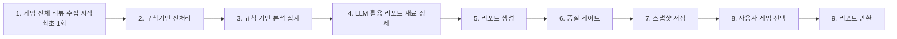
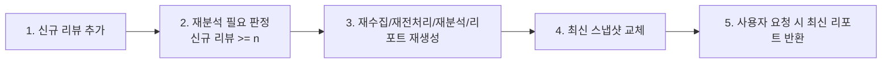

# Steam 리뷰 구매판단 리포트: 발표/설명용 참고 자료

이 문서는 기술 배경이 없는 팀원도 이해할 수 있도록, 시스템이 어떤 구조로 동작하는지 쉽게 설명합니다.

> 중요: 이 문서는 **기준 문서(정책/구현 스펙)**가 아닙니다.  
> 발표자료 제작과 설명용 대시보드 설계를 위한 **참고 문서**이며, 현재 운영 중인 대시보드/코드와 완전히 별개로 사용할 수 있습니다.

## 0. 문서 사용 범위
- 사용 목적: 발표자료, 설명용 대시보드, 온보딩 참고
- 비목적: 구현 기준 강제, 운영 정책 확정, 릴리즈 게이트 기준 대체
- 원칙: 이 문서의 내용은 “설명용 모델”이며, 실제 동작과 차이가 있을 수 있습니다.

## 1. 이 서비스의 목적
- 많은 리뷰를 직접 다 읽지 않아도, 사용자가 **“지금 이 게임을 사도 되는지”** 빠르게 판단하도록 돕는 것이 목적입니다.

## 2. 핵심 운영 원리
- 무거운 작업(수집, 전처리, 분석, LLM)은 **오프라인**에서 미리 수행합니다.
- 사용자는 화면에서 **저장된 리포트만 조회**합니다.
- 이렇게 나눈 이유는, 사용자의 매 호출마다 실시간으로 리뷰를 수집/분석하면 응답 시간이 너무 오래 걸리기 때문입니다.
- 따라서 리뷰를 미리 분석해 리포트를 생성해 두고, 사용자가 특정 게임을 호출할 때 저장된 리포트를 즉시 보여주는 구조를 사용합니다.

실서비스 기준으로는 아래 자동화를 목표로 합니다.
- 신규 리뷰가 `10개` 이상 늘어나면 자동 재수집/재분석/리포트 재생성

다만 현재 단계(데모)에서는 아래처럼 운영합니다.
- 위 자동화는 **기획으로만 유지**하고 실제 자동 실행은 구현하지 않습니다.
- 대신 파이프라인 대시보드에서 “향후 자동화 단계”를 설명용 시각화로만 제공합니다.

즉, 구조는 아래처럼 나뉩니다.
- 오프라인: 수집 -> 전처리 -> 분석 -> 리포트 생성
- 온라인: 저장된 리포트 읽기 전용 제공

## 3. 전체 구조(현재 프로젝트 기준)
1. `demo_games.json`에 데모 대상 게임을 고정합니다.
2. 오프라인 파이프라인이 게임별 리뷰를 처리해 결과 파일을 저장합니다.
3. API는 `report` 파일을 읽어 즉시 반환합니다.

데이터 저장 위치:
- `apps/review-insights/data/raw/`
- `apps/review-insights/data/processed/`
- `apps/review-insights/data/analysis/`
- `apps/review-insights/data/report/`

## 4. 단계별 파이프라인
### Stage 0. 리뷰 수집
- Steam에서 리뷰/메타데이터를 가져와 `raw`, `metadata`에 저장합니다.

### Stage 1. 규칙 기반 전처리
- 텍스트 정리, 한국어 비율 판정, 저품질/욕설-only/비한국어 제외를 수행합니다.
- 제외된 리뷰도 기록은 남기고, 분석에서만 제외합니다.
- 결과를 `processed`에 저장합니다.

### Stage 2. 규칙 기반 분석 집계
- 카테고리, 테마, 최근 변화 신호를 집계합니다.
- 결과를 `analysis`에 저장합니다.

### Stage 3. 리포트 재료 정제(선택적 LLM)
- 분석에 포함된 리뷰 중 활용 가치가 높은 리뷰를 최대 `max_llm_reviews`개 선택합니다.
- LLM이 켜져 있으면 근거 문장을 더 읽기 쉽게 다듬습니다.
- 신뢰도 낮음/실패 시 규칙 기반 fallback을 사용합니다.

### Stage 4. 리포트 생성
- 구매 판단 중심 구조로 리포트를 만듭니다.
- 주요 섹션: `headline`, `buy_recommendation`, `good_for/not_good_for`, `top_strengths/top_risks`, `evidence_sections`

### Stage 5. 근거 정합성 보정(선택)
- 근거 문장이 카드의 긍정/부정 방향과 맞는지 점검하고 필요 시 교체합니다.

### Stage 6. 품질 게이트
- 릴리즈 전 자동 점검으로 최소 품질을 확인합니다.

## 5. LLM 역할과 비역할
LLM을 쓰는 곳:
- 리포트 재료 문장 정제
- 섹션별 리포트 문장 생성
- 근거 정합성 judge

LLM을 쓰지 않는 곳:
- 사용자 요청 경로의 실시간 수집/분석
- 전처리 핵심 필터의 기본 판정

정리: LLM은 주 엔진이 아니라 **보조 엔진**입니다.

## 6. 사용자가 보는 리포트가 만들어지는 방식
- 사용자는 `/api/games/{appid}/report`를 호출합니다.
- 서버는 저장된 `report` 파일을 읽어 즉시 반환합니다.
- 사용자 클릭이 Steam API 호출이나 재분석을 직접 트리거하지 않습니다.

## 7. 품질이 흔들리는 이유
- 리뷰 자체가 장문, 비속어, 혼합 감정, 반어 표현을 포함하기 때문입니다.
- 게임마다 표현 방식이 달라 규칙 사전이 항상 완벽히 맞지 않을 수 있습니다.
- 그래서 규칙 + 선택적 LLM + 품질 게이트를 함께 사용합니다.

## 8. 설명용 대시보드(참고 모델) 구성
1. 수집 패널: 수집 페이지 수, raw 리뷰 수, 마지막 수집 시각  
2. 전처리 패널: 분석 포함 수/제외 수, 제외 사유 분포  
3. 분류 패널: 태그 없음 비율, 대표 테마 없음 비율  
4. 리포트 재료 패널: LLM 호출 수/성공 수/fallback 수  
5. 근거 정합성 패널: 근거 불일치율, 판정불가율, 품질단계 분포  
6. 릴리즈 게이트 패널: 통과/실패, 실패 원인 Top 3

추가 권장:
- `Review Trace`(리뷰 1건 추적) 기능을 넣어, 한 리뷰가 어떤 단계를 거쳐 최종 리포트에 반영됐는지 보여주면 이해도가 크게 올라갑니다.

### 8-1. 화면 와이어프레임(초안)
```text
┌──────────────────────────────────────────────────────────────┐
│ [설명용 대시보드 배지]  Steam 리뷰 파이프라인 큰 흐름        │
│ 오프라인 생성 트랙 / 온라인 조회 트랙                        │
└──────────────────────────────────────────────────────────────┘

┌──────────────────────────────────────────────────────────────┐
│ [메인 플로우 타임라인: 9단계]                                │
│ 1 수집 → 2 전처리 → 3 분석집계 → 4 LLM 재료정제 →            │
│ 5 리포트생성 → 6 품질게이트 → 7 스냅샷저장 →                  │
│ 8 사용자 선택 → 9 리포트 반환                                │
└──────────────────────────────────────────────────────────────┘

┌──────────────────────────────┬───────────────────────────────┐
│ [선택 단계 상세 패널]        │ [별도과정: 업데이트 루프]      │
│ - 단계 설명                  │ 1 신규 리뷰 추가               │
│ - 입력 / 출력                │ 2 재분석 필요 판정(n=10)       │
│ - 핵심 지표 1~2개            │ 3 재수집/재분석/재생성         │
│ - 실패 포인트                │ 4 최신 스냅샷 교체             │
└──────────────────────────────┴───────────────────────────────┘
```

### 8-2. 메인 플로우(9단계) 시각화


### 8-3. 별도과정(업데이트 루프) 시각화


### 8-4. 단계별 mock JSON 스키마(입력/출력/지표)
- 실제 mock 데이터 파일:
  - `apps/review-insights/data/mock/howworks_pipeline.json`

- 프론트에서 사용할 최소 구조:
```json
{
  "pipeline_overview_mock": {
    "main_flow": [
      {
        "stage_no": 1,
        "stage_name": "게임 전체 리뷰 수집 시작",
        "input": {},
        "output": {},
        "metrics": {}
      }
    ],
    "update_loop": [
      {
        "step_no": 1,
        "step_name": "신규 리뷰 추가",
        "input": {},
        "output": {},
        "metrics": {}
      }
    ],
    "note": "업데이트 루프 자동 실행은 실서비스 목표이며, 현재 데모에서는 설명용 시각화만 제공"
  }
}
```

## 9. 쉬운 용어 사전(발표/설명용)
아래 표기는 비전문가가 이해하기 쉽게 바꾼 설명용 용어입니다.

| 내부 지표명 | 쉬운 표기(권장) | 의미 |
|---|---|---|
| `quick_decision_score_4` | 빠른판단 점수(4점 만점) | 핵심 섹션이 갖춰졌는지 보는 종합 점수 |
| `unknown_snippet_rate` | 근거 판정불가율 | 긍/부정을 판정하기 어려운 근거 문장 비율 |
| `mismatch_rate` | 근거 불일치율 | 카드 방향(긍/부정)과 맞지 않는 근거 비율 |
| `evidence_quality_level` | 근거 선별 단계 | strict / relaxed / guaranteed_fill 단계 |
| `included_review_count` | 분석 포함 리뷰 수 | 분석 대상에 실제로 사용된 리뷰 개수 |
| `source_review_count` | 원본 리뷰 수 | Steam에서 가져온 전체 리뷰 개수 |
| `llm_invoked` | LLM 호출 수 | LLM이 실제 요청된 횟수 |
| `llm_success` | LLM 성공 수 | 스키마 검증까지 통과한 응답 수 |
| `fallback_used` | 규칙 대체 사용 수 | LLM 대신 규칙 결과를 사용한 횟수 |
| `forbidden_label_exposure_count` | 금지 라벨 노출 수 | 사용자 화면에 내부 분류 용어가 노출된 횟수 |

## 10. 발표 시 강조할 핵심 3가지
- 사용자 경로는 항상 읽기 전용이어야 합니다.
- 품질 게이트 통과 전에는 데모 노출을 늘리지 않습니다.
- 품질 이슈가 생기면 “어느 단계에서 깨졌는지” 먼저 확인합니다.

## 11. 발표 슬라이드용 1페이지 요약
### 11-1. 개요(What & Why)
- 이 서비스는 “리뷰를 읽어 구매 결정을 돕는 리포트”를 제공합니다.
- 실시간 분석은 느리기 때문에, 오프라인에서 미리 분석해 저장하고 조회 시 즉시 반환합니다.

### 11-2. 메인 플로우(오프라인 -> 온라인)
1. 게임 전체 리뷰 수집 시작(최초 1회)
2. 규칙기반 전처리
3. 규칙 기반 분석 집계
4. LLM 활용 리포트 재료 정제
5. 리포트 생성
6. 품질 게이트
7. 스냅샷 저장
8. 사용자 게임 선택
9. 리포트 반환

### 11-3. 업데이트 루프(실서비스 목표)
1. 신규 리뷰 추가
2. 자동 재분석 필요 판정(`신규 리뷰 >= 10`)
3. 자동 재수집/재분석/리포트 재생성
4. 최신 스냅샷 교체 후 다음 요청에 반영

### 11-4. 데모 현재 상태
- 자동 재분석 루프는 **기획만 존재**하고 현재는 자동 실행하지 않습니다.
- 설명용 대시보드에서는 해당 과정을 “향후 단계”로 시각화만 제공합니다.
